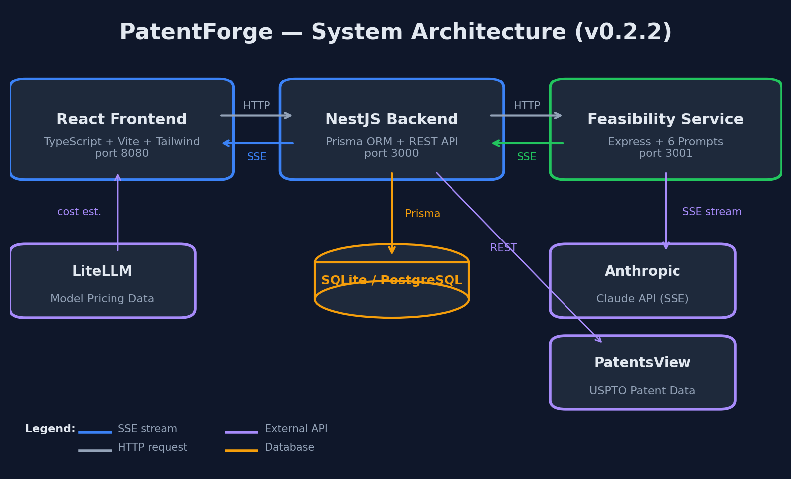
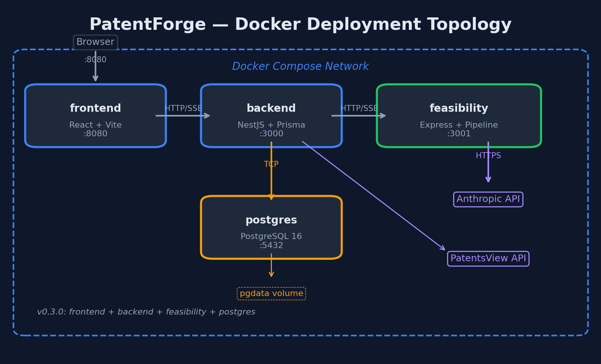

# PatentForge

**AI-powered patent landscape research tool for inventors.**

> **PatentForge is a research tool, not a legal service.** The author of this tool is not a lawyer. This tool does not provide legal advice. It helps inventors explore the patent landscape for their ideas using AI — the same way a book about patents helps you understand the process without replacing an attorney.
>
> By using PatentForge, you are running prompts on your own AI account and generating your own research output. The output is for your personal educational use. It is not a substitute for professional legal counsel.

PatentForge is a self-hosted web application that helps inventors organize their thinking about an invention before consulting a patent attorney. It uses Claude AI to structure a technical analysis, search for related patents, and highlight the questions a patent professional would explore — so you walk into that first meeting prepared, not cold.

## What PatentForge Does

- **Structured technical analysis** — 6-stage AI pipeline that restates your invention in patent terminology, searches for related prior art, identifies potential issues under patent law, and organizes findings into a readable report
- **Prior art discovery** — automated patent search via USPTO Open Data Portal with improved relevance scoring (stop-word filtering, title weighting), plus AI-powered web search for related patents, papers, and products
- **Patent claims viewer** — lazy-loads actual patent claims text from the USPTO Documents API when you click a prior art result (requires free ODP API key)
- **Cost transparency** — pre-run cost estimate based on historical run data (within 25% of actual), per-stage token tracking, and configurable cost cap
- **Resume from interruption** — pick up where you left off if a run stops mid-pipeline
- **Multiple export formats** — HTML, Word (.docx), and Markdown for reports; Word export for claims and compliance results; CSV for prior art
- **AI-assisted claim drafting** — 3-agent pipeline (Planner, Writer, Examiner) generates patent claim drafts informed by your feasibility analysis and prior art, with per-claim examiner review
- **Claim tree visualization** — SVG-based hierarchical view of claim dependencies with list/tree toggle
- **Patent family lookup** — continuity data (parents, children, continuations, divisionals) fetched from USPTO ODP and displayed in the patent detail drawer
- **Compliance checking** — automated validation of claim drafts against 35 USC 112(a) written description, 35 USC 112(b) definiteness, MPEP 608 formalities, and 35 USC 101 eligibility (Alice/Mayo framework), with traffic-light PASS/FAIL/WARN results, MPEP citations, and actionable fix suggestions
- **Patent application generator** — 5-agent LangGraph pipeline assembles a complete USPTO-formatted patent application (background, summary, detailed description, abstract, figure descriptions, IDS) from feasibility analysis, prior art, and claim drafts; exports as USPTO-compliant Word (.docx) with paragraph numbering, watermark, and correct formatting per 37 CFR 1.52, or as Markdown
- **ODP API usage tracking** — queries, results, and rate limit events tracked per search with weekly summary in Settings
- **Self-hosted** — runs on your machine; invention data stays local except for Anthropic API calls
- **Configurable** — choose your model (Sonnet, Opus, Haiku), set max tokens, adjust inter-stage delays

## Important Disclaimer

PatentForge is a **research and preparation tool**, not a legal service. It does not provide legal advice, patent opinions, or attorney services. The output is intended to help you prepare for a consultation with a registered patent attorney or patent agent — not to replace one. Patent law is complex, and decisions about whether to file a patent application should always be made with qualified legal counsel.

### Legal Guardrails Built Into the Software

- **First-run clickwrap** — on first launch, users must acknowledge that PatentForge provides research, not legal advice, before using the app
- **API key disclaimer** — the Settings page notes that users are connecting to their own Anthropic account and should review the provider's data policies
- **Export watermarks** — every generated report (HTML, Word, and on-screen) carries a persistent disclaimer stating the output is AI-generated research, not a legal opinion

## Download

The easiest way to get started is to download the installer for your platform:

| Platform | Download | Notes |
|----------|----------|-------|
| **Windows** | [PatentForge-0.7.1-Setup.exe](https://github.com/scottconverse/patentforge/releases/latest/download/PatentForge-0.7.1-Setup.exe) | Inno Setup installer (~100 MB) |
| **Mac (Beta)** | [PatentForge-0.7.1.dmg](https://github.com/scottconverse/patentforge/releases/latest/download/PatentForge-0.7.1.dmg) | Drag to Applications (~100 MB) |
| **Linux (Beta)** | [PatentForge-0.7.1.AppImage](https://github.com/scottconverse/patentforge/releases/latest/download/PatentForge-0.7.1.AppImage) | chmod +x and run (~120 MB) |

The installer bundles everything — no Node.js, Python, or git required. On first launch, the system tray icon appears and your browser opens to the setup wizard, which walks you through entering your Anthropic API key.

Mac and Linux installers are beta — please report issues on [GitHub Issues](https://github.com/scottconverse/patentforge/issues).

## Quick Start (from source)

### Prerequisites

- [Node.js](https://nodejs.org/) 18+ (recommended: 20 LTS)
- [Python](https://python.org/) 3.11+ (for claim-drafter and compliance-checker services)
- [Anthropic API key](https://console.anthropic.com/) (set in the Settings UI after first launch)

### Install and Run

```bash
git clone https://github.com/scottconverse/patentforge.git
cd patentforge

# Install Node dependencies
cd backend && npm install && cd ..
cd services/feasibility && npm install && cd ..
cd frontend && npm install && cd ..

# Install Python dependencies (claim-drafter and compliance-checker)
pip install uvicorn fastapi anthropic

# Create backend .env (SQLite, zero config)
echo 'DATABASE_URL="file:./prisma/dev.db"' > backend/.env

# Set up the database
cd backend && npx prisma db push && npx prisma generate && cd ..
```

**On Windows** — double-click `PatentForge.bat` (builds and starts all 5 services, opens browser).

The launcher automatically checks for missing `node_modules` and installs them, verifies Python dependencies, and confirms each service port is bound before opening the browser.

**Manual start** (any OS) — run each in a separate terminal:
```bash
# Terminal 1: Backend (port 3000)
cd backend && npm run build && npm start

# Terminal 2: Feasibility service (port 3001)
cd services/feasibility && npm run build && npm start

# Terminal 3: Claim drafter (port 3002)
cd services/claim-drafter && py -m uvicorn src.server:app --port 3002

# Terminal 4: Application generator (port 3003)
cd services/application-generator && py -m uvicorn src.server:app --port 3003

# Terminal 5: Compliance checker (port 3004)
cd services/compliance-checker && py -m uvicorn src.server:app --port 3004

# Terminal 6: Frontend (port 8080)
cd frontend && npm run dev
```

Open http://localhost:8080, go to **Settings** (gear icon), enter your Anthropic API key, and create your first project.

### Docker (alternative)

```bash
# Optionally set your API key (or configure later in the Settings UI)
export ANTHROPIC_API_KEY=your-key-here

docker compose up --build
```

Open http://localhost:8080. Uses PostgreSQL instead of SQLite.

### Troubleshooting

- **Port already in use** — kill the process occupying the port (`Get-NetTCPConnection -LocalPort 3000` on Windows, `lsof -i :3000` on Mac/Linux), or change the port in the service config.
- **"No API key configured"** — open Settings (gear icon) and enter your Anthropic API key. The key is encrypted at rest.
- **Python services won't start** — ensure uvicorn and fastapi are installed: `pip install uvicorn fastapi anthropic`
- **Prisma errors** — run `cd backend && npx prisma db push && npx prisma generate` to reset the database schema.

## How It Works

PatentForge runs a 6-stage sequential analysis pipeline using the Anthropic Claude API:

| Stage | Name | What It Does |
|-------|------|-------------|
| 1 | Technical Intake & Restatement | Restates your invention in precise technical language |
| 2 | Prior Art Research | Searches for existing patents, papers, and products |
| 3 | Patentability Review | Identifies potential issues under 35 USC 101, 102, 103, and 112 |
| 4 | Deep Dive Analysis | Domain-specific landscape analysis tailored to the invention's technical areas |
| 5 | Strategy Notes | Summarizes filing considerations, cost factors, and open questions |
| 6 | Consolidated Report | Assembles all findings into a single structured document |

Each stage builds on the output of all previous stages. Stages 2, 3, and 4 use Anthropic's web search tool for grounded research.

**Note:** The output of this pipeline is structured research, not a legal opinion. It is designed to help you and your patent attorney have a more productive first conversation.

## Architecture


*Figure 1: System Architecture (v0.7.1) — 6 services + system tray + 3 external APIs*

```
┌─────────────────┐     ┌─────────────────┐     ┌─────────────────┐
│  React Frontend │────▶│  NestJS Backend  │────▶│  Feasibility    │
│  (Vite, TW CSS) │     │  (Prisma, SQLite)│     │  Service (TS)   │
│  port 8080      │◀────│  port 3000       │◀────│  port 3001      │
└─────────────────┘ SSE └─────────────────┘ SSE └─────────────────┘
                                │                       │
                                │                       ▼
                                │                Anthropic Claude API
                                ▼
                        ┌─────────────────┐     ┌─────────────────┐
                        │  Claim Drafter  │     │  Compliance     │
                        │  (Python/       │     │  Checker        │
                        │   LangGraph)    │     │  (Python/       │
                        │  port 3002      │     │   LangGraph)    │
                        └─────────────────┘     │  port 3004      │
                                                └─────────────────┘
                        ┌─────────────────┐
                        │  Application    │
                        │  Generator      │
                        │  (Python/       │
                        │   LangGraph)    │
                        │  port 3003      │
                        └─────────────────┘
```

- **System Tray (Installer)** — Go binary that launches and monitors all services, with health checks, auto-restart, and log rotation
- **Frontend** — React 18, TypeScript, Tailwind CSS, Vite (served by backend in production)
- **Backend** — NestJS, Prisma ORM, SQLite (dev) / PostgreSQL (Docker). Node SEA binary in installer.
- **Feasibility Service** — Express, Anthropic SSE streaming, 6 prompt templates. Node SEA binary in installer.
- **Claim Drafter** — Python, FastAPI, LangGraph, 3-agent pipeline (Planner/Writer/Examiner)
- **Compliance Checker** — Python, FastAPI, LangGraph, 4 specialized checker agents (port 3004)
- **Application Generator** — Python, FastAPI, LangGraph, 5-agent pipeline (port 3003)

See [ARCHITECTURE.md](ARCHITECTURE.md) for the full system design.

## Configuration

All settings are configurable via the Settings page in the UI:

| Setting | Default | Description |
|---------|---------|-------------|
| Anthropic API Key | — | Required. Your Claude API key. Encrypted at rest (AES-256-GCM). |
| USPTO API Key | — | Optional. Free key from [data.uspto.gov](https://data.uspto.gov/myodp) for enhanced patent search and claims viewing. Encrypted at rest. |
| Default Model | — | Required. Choose Sonnet, Opus, or Haiku before running analysis. No silent fallback. |
| Research Model | — | Optional separate model for Stage 2 (e.g., Haiku for cost savings) |
| Max Tokens | 32,000 | Maximum tokens per stage response |
| Inter-Stage Delay | 5 seconds | Pause between stages for rate limit protection |
| Cost Cap (USD) | 5.00 | Enforced server-side. Blocks new runs when cumulative project cost exceeds this amount. Mid-pipeline cancellation when a stage pushes cost over the cap. Set to 0 to disable. |
| Export Path | Desktop | Folder for saved reports. Must be within your home directory. |

### Authentication (Optional)

For network deployments, set the `PATENTFORGE_TOKEN` environment variable to require Bearer token auth on all API requests. When not set, auth is disabled (single-user local mode).

### Internal Service Security

The feasibility service (port 3001), claim-drafter service (port 3002), and compliance-checker service (port 3004) are internal-only — the frontend communicates through the NestJS backend, which proxies requests. Set `INTERNAL_SERVICE_SECRET` to require a shared secret header on all internal service calls. The backend uses `COMPLIANCE_CHECKER_URL` (default `http://localhost:3004`) to reach the compliance checker. In local dev, the shared secret is optional.

**Docker deployments:** The default secret is `patentforge-internal` — a known public value. **Set a custom secret** before deploying:

```bash
export INTERNAL_SERVICE_SECRET=$(openssl rand -hex 32)
docker compose up --build
```


*Figure 2: Docker Compose Deployment (7 containers)*

## Roadmap

- [x] **v0.1** — 6-stage AI analysis pipeline with streaming
- [x] **v0.2** — Prior art search, cost tracking, Word export, resume from interruption
- [x] **v0.3.0** — USPTO patent detail enrichment, individual stage re-run, CSV export
- [x] **v0.3.1** — USPTO Open Data Portal integration (replaces deprecated PatentsView API)
- [x] **v0.3.2** — Lazy-load patent claims from USPTO Documents API
- [x] **v0.3.3** — Playwright E2E tests, DOCX parser improvements, type safety, CORS hardening
- [x] **v0.3.4** — Scoring improvements, API key encryption, prompt integrity, CI pipeline, auth skeleton
- [x] **v0.4.0** — AI-assisted claim drafting (Python + LangGraph, 3-agent pipeline)
- [x] **v0.4.1** — Claim tree visualization, patent family tree lookup
- [x] **v0.5.0** — Compliance review tooling
- [x] **v0.5.1** — Public release polish (CORS, installer, parser quality, accessibility)
- [x] **v0.5.2** — Quality patch (13 items from tech/UI/QA review)
- [x] **v0.6.0** — Full application document assembly (5-node LangGraph pipeline, Word + Markdown export)
- [x] **v0.6.1** — Hardening patch (Docker data safety, configurable port, startup validation, source maps, accessibility, disclaimer E2E test)
- [x] **v0.7.0** — Windows installer, Mac/Linux beta, system tray, Node SEA, first-run wizard
- [x] **v0.7.1** — Polish patch (18 fixes from external code review)

## Contributing

See [CONTRIBUTING.md](CONTRIBUTING.md) for setup instructions and guidelines.

## License

**Code** (backend, frontend, services): [MIT](LICENSE)

**Prompt content** (`services/feasibility/src/prompts/`): [CC BY-SA 4.0](LICENSE-PROMPTS)

See [LEGAL_NOTICE.md](LEGAL_NOTICE.md) for important information about this tool's limitations and your responsibilities.
